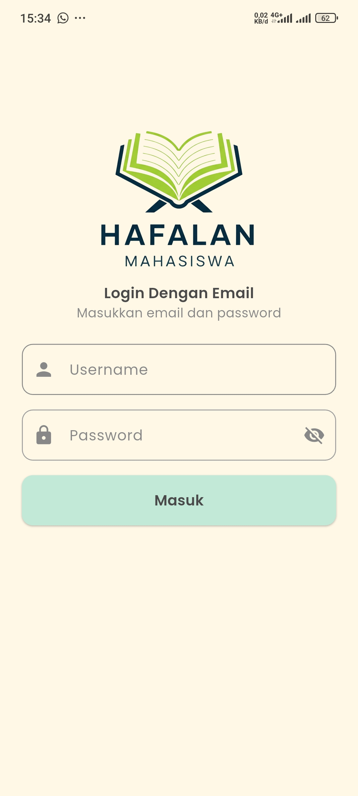
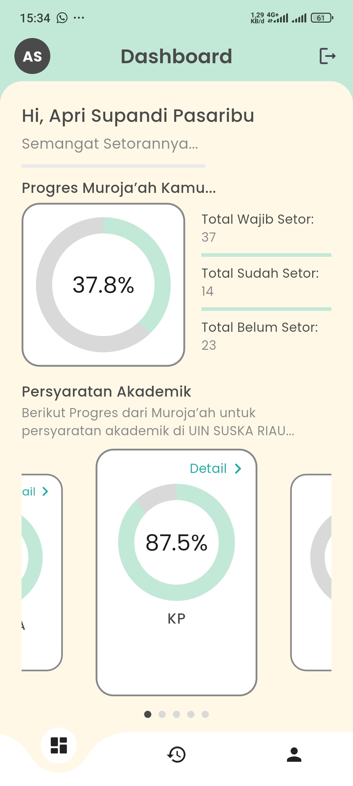
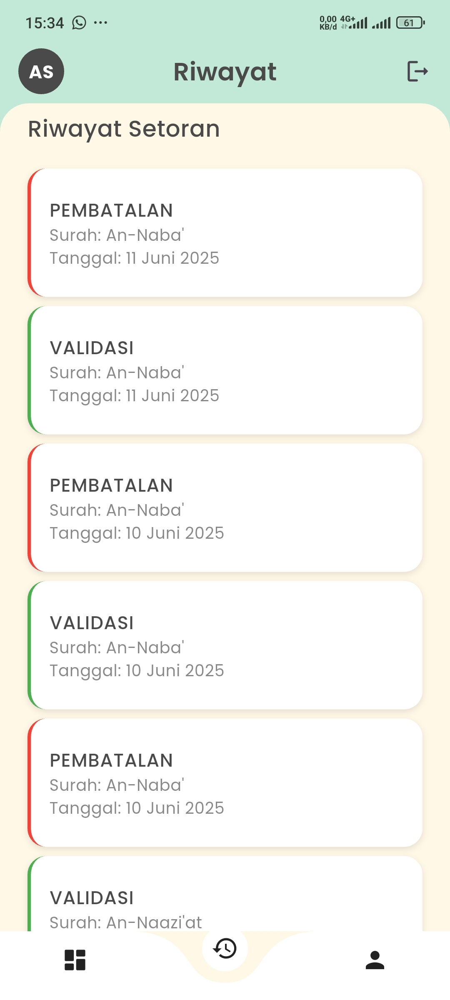
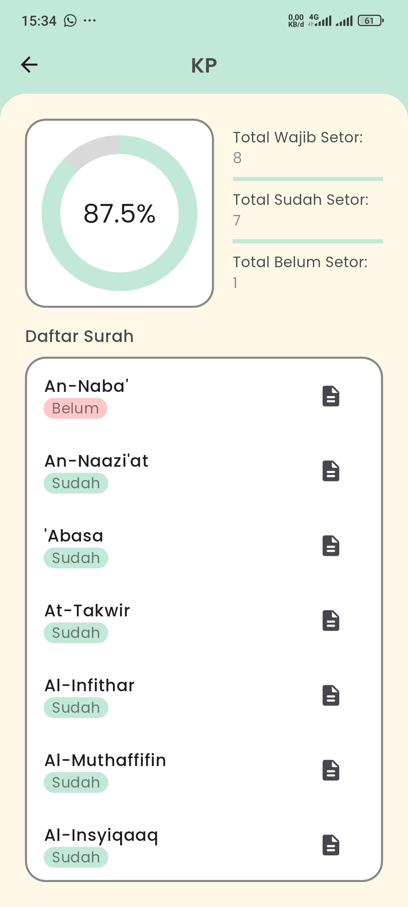
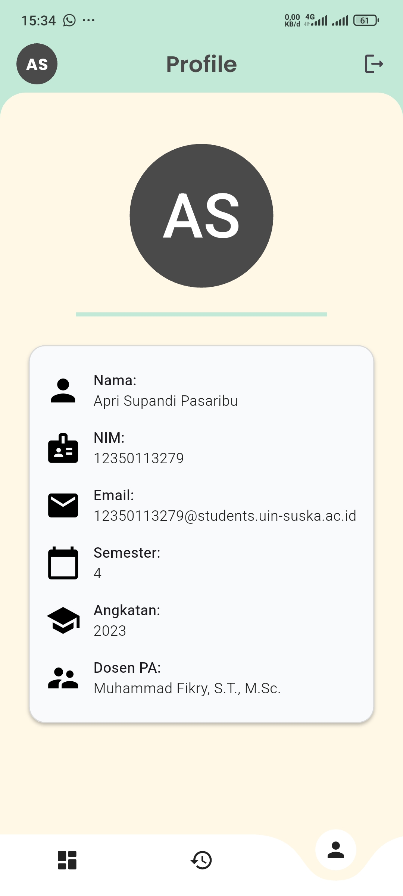

# HAFALAN MAHASISWA - Aplikasi Manajemen Setoran Hafalan Mahasiswa UIN SUSKA RIAU


---

## Deskripsi

**Hafalyuk MHS** adalah aplikasi mobile berbasis Flutter yang dirancang untuk membantu mahasiswa **Universitas Islam Negeri Sultan Syarif Kasim Riau (UIN SUSKA RIAU) Teknik Informatika** dalam mengelola progres setoran hafalan Al-Qur'an sebagai bagian dari persyaratan akademik. Aplikasi ini memudahkan mahasiswa dalam mencatat, memantau, dan melacak pencapaian hafalan mereka melalui antarmuka yang intuitif dan desain yang responsif.

---

## Fitur Utama

### ✨ Dashboard Progres Hafalan

* Menampilkan persentase progres hafalan secara keseluruhan dan per kategori:

  * KP
  * SEMKP
  * DAFTAR TA
  * SEMPRO
  * SIDANG TA
* Visualisasi progres menggunakan indikator persentase dan carousel slider.
* Statistik total wajib setor, sudah setor, dan belum setor.

### ⌛ Riwayat Setoran

* Menampilkan log aktivitas setoran (validasi atau pembatalan).
* Tampilan kartu dengan warna hijau untuk validasi dan merah untuk pembatalan.

### 📄 Detail Hafalan

* Daftar surah per kategori dengan status (sudah/belum setor).
* Bottom sheet untuk melihat detail surah.

### 👤 Profil Mahasiswa

* Informasi mahasiswa seperti nama, NIM, email, semester, angkatan, dan dosen pembimbing akademik.
* Avatar dinamis berdasarkan inisial nama.

### 🔐 Autentikasi Aman

* Login menggunakan **Keycloak** dengan manajemen token.
* Logout dengan konfirmasi dialog.
* Redirect otomatis ke halaman login saat sesi kadaluarsa.

### 🔄 Refresh Data

* Pull-to-refresh pada dashboard untuk memperbarui data.

### 🌈 Desain Responsif

* Menggunakan **GoogleFonts (Poppins)** untuk tipografi.
* Warna tema lembut (krem, hijau, abu-abu).
* Navigasi bawah melengkung menggunakan **curved\_navigation\_bar**.

---

## Teknologi yang Digunakan

* **Framework:** Flutter (Dart)
* **Manajemen State:** StatefulWidget
* **HTTP Client:** Dio
* **Autentikasi:** Keycloak, flutter\_secure\_storage, jwt\_decoder
* **Manajemen Lingkungan:** flutter\_dotenv
* **UI Komponen:**

  * google\_fonts
  * percent\_indicator
  * carousel\_slider
  * curved\_navigation\_bar
  * shimmer
* **Manajemen Aset:** File .env, gambar, dan ikon aplikasi.
* **Ikon:** Material Icons

---

## Struktur Proyek

```
hafalyuk_mhs/
├── assets/
│   ├── fonts/
│   │   └── Poppins-Medium.ttf
│   ├── images/
│   │   └── logoApp.png
├── lib/
│   ├── models/
│   ├── pages/
│   ├── services/
│   ├── widgets/
├── .env
├── pubspec.yaml
└── README.md
```

---

## Cara Instalasi

### Prasyarat

* Flutter SDK
* Editor kode (VS Code atau Android Studio)
* Emulator atau perangkat fisik untuk pengujian

### Langkah Instalasi

1. **Kloning Repositori:**

```bash
git clone https://github.com/BgApii/hafalyuk_mhs.git
cd hafalyuk_mhs
```

2. **Konfigurasi Lingkungan:**
   Buat file `.env` di root proyek dengan isi:

```env
URL_API=<API_URL>
BASE_URL=<BASE_URL>
KC_URL=<KEYCLOAK_URL>
CLIENT_ID=<KEYCLOAK_CLIENT_ID>
CLIENT_SECRET=<KEYCLOAK_CLIENT_SECRET>
```

3. **Instal Dependensi:**

```bash
flutter pub get
```

4. **Jalankan Aplikasi:**

```bash
flutter run
```

---

## Cara Penggunaan

* **Login:** Masukkan username dan password.
* **Dashboard:** Pantau progres hafalan dan geser carousel untuk melihat kategori.
* **Riwayat:** Lihat log setoran yang sudah dilakukan.
* **Detail Hafalan:** Klik kategori untuk melihat daftar surah dan detailnya.
* **Profil:** Lihat data diri mahasiswa.
* **Logout:** Klik ikon logout dan konfirmasi.

---

## Screenshot

<p align="center">
  
  
  
  
  
</p>

---

## Kontak

Untuk pertanyaan atau dukungan, hubungi: **\[[aprissupandi@gmail.com](mailto:aprissupandi@gmail.com)]**
